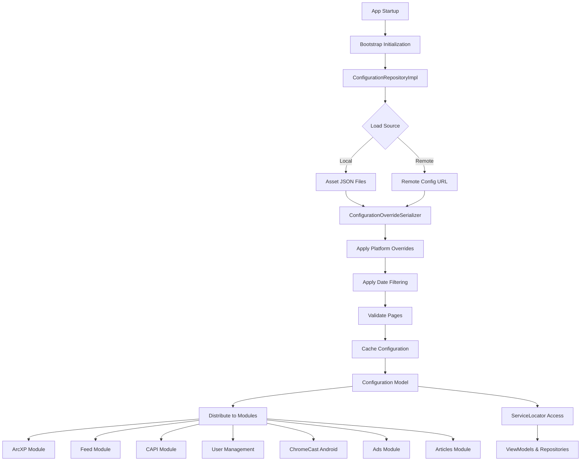

```mermaid
graph TB
    A[App Startup] --> B[Bootstrap Initialization]
    B --> C[ConfigurationRepositoryImpl]

    C --> D{Load Source}
    D -->|Local| E[Asset JSON Files]
    D -->|Remote| F[Remote Config URL]

    E --> G[ConfigurationOverrideSerializer]
    F --> G

    G --> H[Apply Platform Overrides]
    H --> I[Apply Date Filtering]
    I --> J[Validate Pages]
    J --> K[Cache Configuration]

    K --> L[Configuration Model]

    L --> M[Distribute to Modules]
    M --> N[ArcXP Module]
    M --> O[Feed Module]
    M --> P[CAPI Module]
    M --> Q[User Management]
    M --> R[ChromeCast Android]
    M --> S[Ads Module]
    M --> T[Articles Module]

    L --> U[ServiceLocator Access]
    U --> V[ViewModels & Repositories]
```