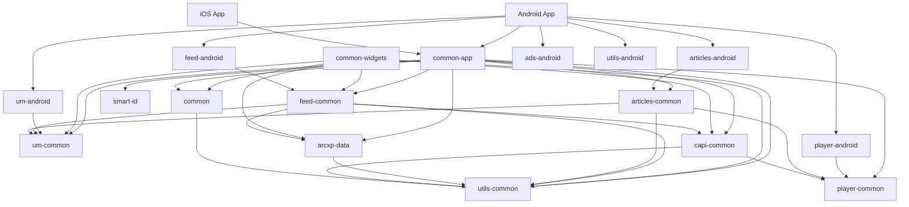
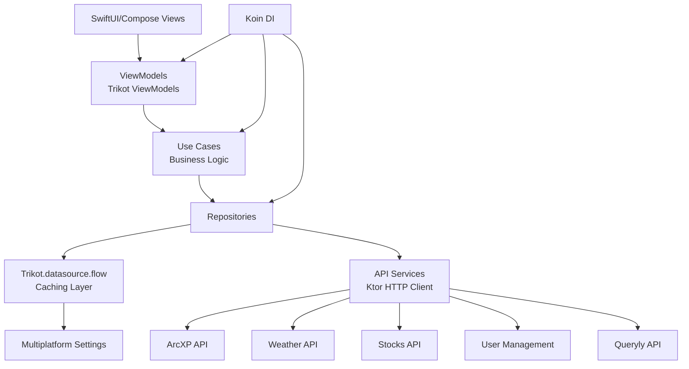
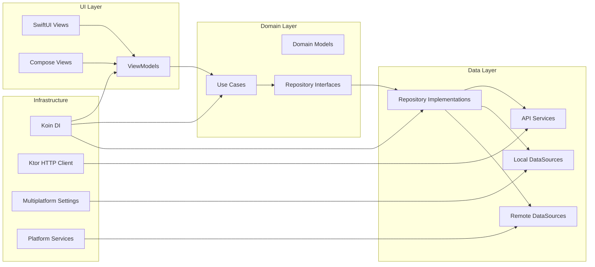

# Architecture Overview

## Project Structure
This is a multiplatform mobile application built with Kotlin Multiplatform (KMP) and Swift for iOS, targeting three news brands: BNN, CP24, and CTVNews. The project uses shared business logic across platforms with platform-specific UI implementations.

## Technology Stack
- **Kotlin Multiplatform**: Shared business logic and data layer
- **Android**: Jetpack Compose UI with Kotlin
- **iOS**: SwiftUI with shared KMP modules
- **Build System**: Gradle (Android/Common) and Xcode (iOS)
- **Dependency Injection**: Koin
- **HTTP Client**: Ktor
- **UI Framework**: Trikot ViewModels with Pilot Navigation
- **Analytics**: mParticle, Permutive, Comscore, Chartbeat
- **Video Player**: Jasper Player (Bell Media proprietary)
- **Ads**: Google Mobile Ads with Prebid integration

## Module Architecture

### Core Modules
- **`common`**: Base shared module with core utilities, data sources, and bootstrapping
- **`common-app`**: Main shared application logic, ViewModels, repositories, and use cases
- **`common-widgets`**: Shared widget components for iOS home screen widgets
- **`android`**: Android-specific UI implementation using Jetpack Compose
- **`ios`**: iOS-specific UI implementation using SwiftUI

### Shared Modules (from submodules/bellmedia-common-mobile)
- **`ads`**: Advertisement integration and management
- **`articles`**: Article content display and management
- **`capi`**: Content API integration
- **`feed`**: Feed content and display logic
- **`player`**: Video player integration
- **`smart-id`**: Smart ID service integration
- **`usermanagement`**: User authentication and management
- **`utils`**: Common utilities and helpers

## Brand Configuration
The app supports three brands with different configurations:
- **BNN**: Business news application (`ca.bellmedia.bnngo`)
- **CP24**: Toronto news application (`ca.bellmedia.cp24`)
- **CTVNews**: National news application (`ca.bellmedia.ctvnews`)

## Environment Configuration
Multiple environments are supported:
- **Development**: `.dev` suffix for development builds
- **CI**: `.ci` suffix for continuous integration builds
- **Stable**: `.stable` suffix for staging builds  
- **Production**: Production releases

## Data Architecture
- **Repository Pattern**: Data access abstraction layer
- **Use Cases**: Business logic implementation
- **ViewModels**: UI state management using Trikot ViewModels
- **Dependency Injection**: Koin for dependency management
- **Local Storage**: Multiplatform Settings for key-value storage
- **Caching**: Local caching with StateData extensions

## Key Features
- **Multi-brand Support**: Single codebase supporting BNN, CP24, and CTVNews
- **Personalization**: My News sections, bookmarks, weather cities, stock favorites
- **Search**: Querily-powered search functionality
- **Video**: Live and on-demand video content
- **Weather**: Location-based weather information
- **Stocks**: Real-time stock market data (BNN specific)
- **Notifications**: Push notifications with Braze
- **Analytics**: Comprehensive analytics tracking
- **Widgets**: iOS home screen widgets

## Architecture Diagrams

### 1. Module Dependency Architecture

### 2. Data Flow Architecture

### 3. Clean Architecture Layers

# Config

### Environment-Specific Configuration
- Configuration files located in `config/[brand]/qa/config.json`
- Runtime configuration loading from remote sources
- Environment-specific API endpoints and feature flags

### Build Configuration
- **Android**: Gradle with Kotlin DSL, multiple build variants
- **iOS**: Xcode project with multiple schemes and targets
- **Shared**: Gradle build for KMP modules

# Libraries

### Core Libraries
- **Kotlin Multiplatform**: Shared business logic
- **Trikot**: ViewModels, HTTP, Streams
- **Koin**: Dependency Injection
- **Ktor**: HTTP Client
- **Kotlinx Serialization**: JSON serialization
- **Kotlinx Coroutines**: Async programming

### Android Libraries
- **Jetpack Compose**: Modern UI toolkit
- **Material 3**: Design system
- **Navigation Compose**: Navigation
- **Paging**: Data pagination
- **Coil**: Image loading
- **Lottie**: Animations

### iOS Libraries
- **SwiftUI**: Native iOS UI framework
- **Kingfisher**: Image loading
- **Lottie**: Animation support
- **PinLayout**: Layout management

### Video & Media
- **Jasper Player**: Bell Media proprietary video player
  - Core player functionality
  - Ads integration
  - Cast support (Google Cast)

### Analytics & Monitoring
- **mParticle**: Core analytics
- **Permutive**: Audience platform
- **Comscore**: Analytics
- **Chartbeat**: Real-time analytics
- **New Relic**: Performance monitoring
- **Firebase**: Crashlytics and Analytics

### Advertising
- **Google Mobile Ads**: Ad serving
- **Prebid Mobile**: Programmatic advertising
- **Amazon Publisher Services**: Header bidding

# API Services

## Content & Data APIs
- **Arcxp**: Primary content management system
- **CAPI (Axis)**: Secondary content API
- **Stocks API**: Real-time market data (BNN specific)
- **Weather API**: Weather data (CP24 / CTVNews specific)

## User & Analytics Services
- **UM (User Management)**: Bell Media user authentication
- **Querily**: Search service integration
- **Tapad**: Cross-device user tracking
- **SmartID**: User identification service

## Infrastructure Services
- **Bell Nexus**: Internal Maven repository
- **Firebase**: Push notifications, analytics, crash reporting
- **Braze**: Customer engagement platform
